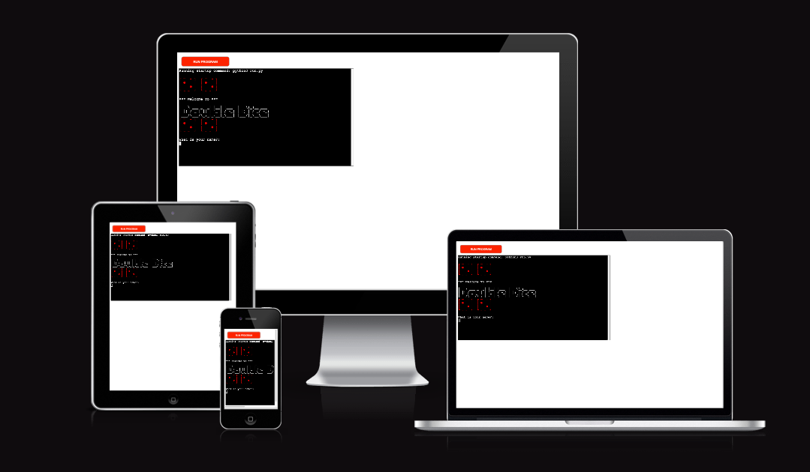

<h1 align="center"></h1>

# Double Dice

## Portfolio Project 3 - Python

I have created a fun and easy dice roll game inspired by my own personal love of dice, and also taking inspiration from the very old school Vegas gaming screens you see in the older casinos. 
 
The aim of the game is to roll a double, and to try and beat the high score tracker. The project can be trialed and played on the mock terminal via Heroku: <a href ="https://https://double-dice-20fa2b8b4398.herokuapp.com/" target="_blank">Double Dice live link</a>

# Planning

## Target Audience

The target audience for this project is designed for all ages, but the concept was inspired by old school game face machines that you see in Vegas. I believe ultimately I would like to develop this game or a game similar for an older audience when it comes to implementing future features into the game. 

## User Goals
As a player I want.. 
- To have fun and be challenged to beat the high score tracker
- To understand the rules of the game clearly
- To be offered a chance to continue with play, or to exit as they wish
- To easily navigate the game and ease of access to inputs
- To be able to view their score after each game has ended
- To want to return to play the game again to try and beat the high score

## Web Owner Goals
As a web owner I want.. 
- To have a clear and easy game with little to no negative feedback from a game player
- To maintain a highest score feature easily, no matter how many deployed versions of the game there are
- The overall game to have no errors or bugs

## Research

I conducted my research by looking up online games involving dice, mainly on Youtube. I watched real life dice games, as well as automated versions on Python programming. 

# Existing Features

## Welcome message

I wanted to incorporate some design elements to the Heroku terminal project to make it more interesting for the game player. I used ascii art that I made myself (the dice), along with ascii art I found through an ascii art online generator.
The initial landing page shows pairs of dice to give the player a visual idea of what the game is about. 

## ASCII Art

## Game Play

I chose to use color throughout the game to indicate whether the player has rolled a double by displaying green, or if it's not a double, red. The user plays for as long as they wish, with an exit option at any stage throughout the game play. If the player hits a new high score of all time, a message will display at the end of the game to indicate they have achieved a new high score.

# Testing

## Manual Testing

"What Is Your Name" input
- Entering input name correctly with letters
- Entering nothing
- Entering a non-alpha character such as a number 
Result: "Not a valid input, please try again"

"Would you like to view previous highest score" input
- Entering input correctly with 'y' or 'n'
- Entering nothing
- Entering a non-alpha character such as a number 
Result: "Not a valid input. Please answer y or n"

"Start new game select y or n" input
- Entering input correctly with 'y' or 'n'
- Entering nothing
- Entering a non-alpha character such as a number 
Result: "Please answer y or n"

"Roll the dice again? y or n" input
- Entering input correctly with 'y' or 'n'
- Entering nothing
- Entering a non-alpha character such as a number 
Result: "Not a valid input. Please select y or n"

## Validator Testing

## PEP8
PEP8 testing was done using the Code Institute Python Linter. The test results display errors relating to the ascii art in the welcome message display. I have left these errors as they aren't affecting the code, and they are intentional for the purpose of the message display. All other testing came back without errors otherwise.
<h1 align="center"></h1>

## User Testing

I have had friends and family testing out the game for me within a 2 week span, taking note of their feedback and any issues encountered. Any bugs found during user testing have been logged, below, in the bug/errors section. My mentor also carried out user testing for me to ensure the project runs smoothly on the Heroku deployed terminal.

## Python libraries

- random: To randomly select the dice numbers upon each roll
- os: Used for its clear tool
- time: To allow short time break intervals where allocated as a pause
- gspread: To pull and push the high score from google spreadsheet to the game
- colorama: To use color in the terminal for the welcome message and alerts for each roll result

# Bugs/Errors or Issues Encountered
- I had a small bug during the initial build, which created an infinate loop when rolling the dice. I managed to fix it simply by restarting the game running sequence with the 'main' function.
- I had a issue with the scoring system in that I wasn't sure if I wanted to keep the highest score unique to the player, or to track a highest score in general for whoever has played the game. I feel like this is something to work on in future versions of the game.
- I had a bug issue in relation to the score data being pushed to my Google API. It was a minor coding error, yet significant in terms of the running of the game and score tracking. The CI tutor support services helped me out with finding the issue within my code to help make it work in tune with the running of the game.

# Features left to implement

- As mentioned above, I would like to implement on the highest score feature and add a scoreboard that tracks usernames and their scores so that the player can try make it onto the leaderboard.
- I would like to create an alternative game option to play in real time against the computer where you try to beat the computer's score in each round.

# Deployment

This project was developed through Gitpod (template by Code Institute).
The site was deployed via <a href ="https://heroku.com" target="_blank">Heroku</a>

## Steps To Deployment

## Credentials & Google Sheets
- Make a copy of the Google sheet for this game <a href ="https://docs.google.com/spreadsheets/d/1Si_b5sxEleqx4J-tKZkqhL6v2lEsdA4Tp2kw4fLhRxk/edit#gid=0" target="_blank">here.</a>
- Create a new project on Google Could Platform and enable the Google Drive API.
- Create your credentials for accessing the application data.
- Grant permissions of 'Editor'
- Create new service account 'JSON'.
- Copy the email address under Service Accounts and add this as an Editor to your copy of the Google sheet.

## Heroku
- Log in or register a new account on Heroku.
- Click on 'New' in the dashboard, then select 'Create New App'.
- Select a suitable app name that is available and choose your region.
- Click on 'Create app'.
- Once created, choose Settings.
- As per Code Institute guidelines, add Config Var with Key = PORT and the Value = 8000.
- Add buildpacks: Python and Nodejs, in this specific order.
- Select 'Deploy' and select 'GitHub'.
- Select 'Connect to GitHub'.
- Search for your project GitHub repository name.
- Select 'Connect'.
- Select 'Deploy Branch'.
- If steps are taken correctly, the message should state "The app was successfully deployed" when the app is built with python and all the depencencies.
- You can click the 'view' button to view the live link site.

<h1 align="center"></h1>

# Credits & Acknowledgements

## Content

- Python tutorial inspired from <a href="https://www.youtube.com/watch?v=x-Ag2_bJ40Y&t=466s" target="_blank"> YouTube Bro Code Dice Roller Program</a>
- Python tutorial adapted from <a href="https://medium.com/@haseebzeeshan2010/multiple-dice-game-using-ascii-art-in-python-9f9ad4f63fd3" target="_blank">Medium blog on dice roll game</a>
- General source: <a href="https://www.geeksforgeeks.org" target="_blank">Geeks For Geeks</a>
- General source: <a href="https://www.stackoverflow.com" target="_blank">Stack Overflow</a>

## Formatting & Validating Tools

- Python formatting tool: <a href="https://codebeautify.org/python-formatter-beautifier" target="_blank">Code Beautify</a>
- Code Institute Python Linter: <a href="https://pep8ci.herokuapp.com/#" target="_blank">PEP8</a>

## Media

- ASCII Art: <a href="https://patorjk.com/software" target="_blank">Ascii Art Generator</a>

## Acknowledgements

Thanks to my mentor, Excellence Ilesanmi, who helped guide me through each step of the building process of my game from idea to inception. A special thanks to the Code Institute tutor service team, with a special mention to Roo and Thomas for their great help for when bug issues arose within my project towards the completion phase.

